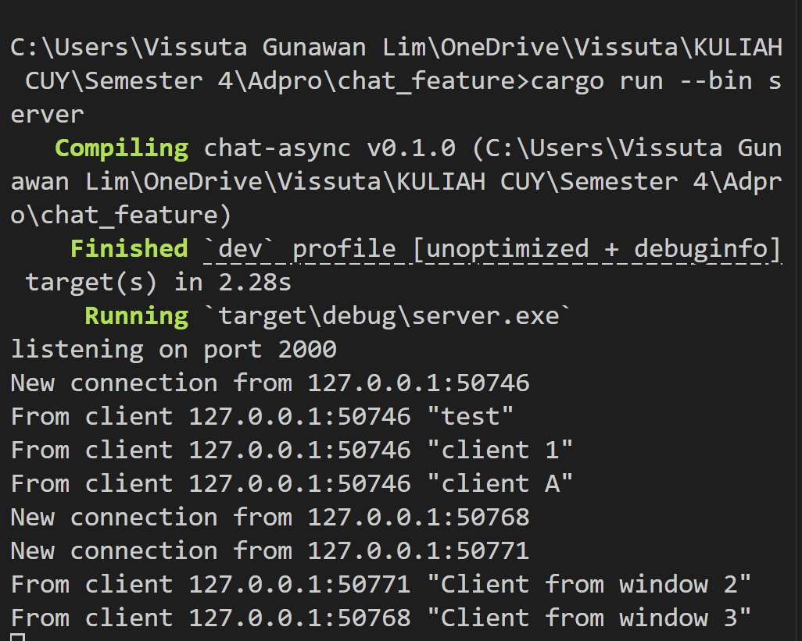
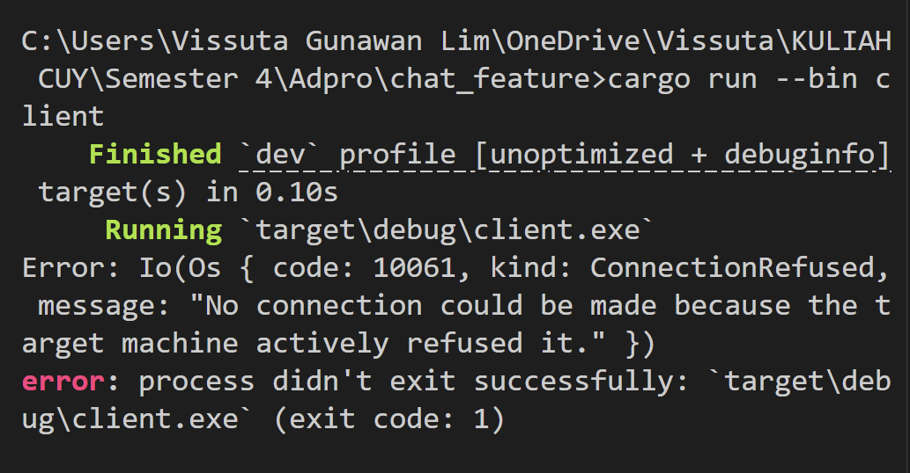

# Reflection 10
---

## Tutorial 2

### Initial Experiment

This illustrates a typical broadcast-style chat server architecture. Upon connection, each client is greeted with a welcome message from the server. The server operates by receiving messages from any connected client, recording them in its logs, and then distributing them to every connected client simultaneously.

The implementation uses Tokio's broadcast channel mechanism to efficiently send messages to all participants. This is why each message appears across all client terminals tagged with the "From server:" label. The system creates a group chat environment where every participant can see all communications - when one client sends a message, it gets relayed through the server to every other connected client, ensuring complete visibility of the conversation for all participants.

In essence, the server acts as a central hub that captures and redistributes all messages, making sure that no client misses any part of the ongoing conversation.

### Modify Port

#### Server Port 2000, Client Port 8080

In the first scenario, connections failed because there was a port mismatch - the clients were attempting to establish connections on port 8080, but the server was actively listening on port 2000. Since network connections require both sides to use the same port for communication, this mismatch prevented any successful connections.

#### Server Port 8080, Client Port 8080

In the second scenario, successful connections were established because the server and all clients were configured to use the same port (8080). When both the server and clients targeted the identical port number, they could successfully establish communication channels.

This demonstrates a core networking concept: for client-server communication to work, the server must be actively listening on the precise port that clients are trying to connect to. Without this port alignment, the connection attempts will fail because the server isn't monitoring the port where clients are knocking.